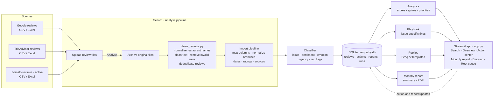

# Empathy Engine: Streamlit ORM app

## Architecture



## Folder structure

```
empathy_engine/
├── app.py                     ← Streamlit front end (the 4 screens)
├── requirements.txt
├── .env.example               ← optional GROQ_API_KEY
├── .streamlit/config.toml     ← theme colours, upload size
├── engine/                    ← back end
│   ├── config.py              ← restaurant aliases, 10 issue categories, keywords, thresholds  (edit this)
│   ├── db.py                  ← SQLite tables: reviews, actions, reports, runs
│   ├── importer.py            ← reads + cleans CSV/Excel (names, branches, dates, ratings, text)
│   ├── classifier.py          ← issue, sentiment, emotion, urgency 1-10, red-flag words
│   ├── analytics.py           ← reputation score, KPIs, spikes, top issues, priority ranking
│   ├── playbook.py            ← fix, owner and deadline for each issue  (edit this)
│   ├── replies.py             ← empathetic replies: Groq LLM or templates
│   └── report.py              ← monthly summary + PDF
├── tools/
│   ├── make_sample_data.py    ← creates 6 months of sample files (to try the app first)
│   ├── seed_demo_actions.py   ← sample data only: fake past replies so the KPIs have numbers
│   └── discover_issues.py     ← optional: MiniLM + HDBSCAN + Groq re-labelling (your dissertation method)
└── data/
    ├── raw/google/  raw/zomato/  raw/tripadvisor/   ← put your files here
    ├── empathy.db             ← created automatically
    └── reports/               ← monthly PDFs
```

## Step-by-step setup (Windows / VS Code)

**1. Install Python 3.10+**, then open the `empathy_engine` folder in VS Code and open a terminal.

**2. Create a virtual environment and install packages**
```bash
python -m venv .venv
.venv\Scripts\activate            # Mac/Linux: source .venv/bin/activate
pip install -r requirements.txt
```

**3. (Optional) Try it with sample data first**
```bash
python tools/make_sample_data.py
python -m engine.importer --reset --scraped-on 2026-09-26
python tools/seed_demo_actions.py
streamlit run app.py
```
The browser opens at http://localhost:8501. When you're ready for your real data, delete the sample files in `data/raw/*/` and continue.

**4. Put your real files in place**

| Source | Folder | Formats |
|---|---|---|
| Google Reviews | `data/raw/google/` | .csv, .xlsx |
| Zomato | `data/raw/zomato/` | .csv, .xlsx |
| TripAdvisor | `data/raw/tripadvisor/` | .csv, .xlsx |

The importer recognises common column names on its own. A file needs a **review text** column and a **date** column. Restaurant, branch, rating and issue columns are optional but recommended.

| Meaning | Column names it recognises |
|---|---|
| Review text | review_text, text, review, comment, content, body, cleaned_review |
| Date | review_date, date, published, posted_on, time, relative_date, reviewed_on |
| Rating | rating, rated, stars, score, bubble_rating (40 → 4) |
| Restaurant | restaurant, restaurant_name, chain, brand, place, name |
| Branch | branch, location, locality, area, outlet, address |
| Issue (from your HDBSCAN run) | issue, issue_category, cluster_label, category, label |

* If your Google file's `name` column holds the **reviewer's** name, rename it to `reviewer` first, or it will be read as the restaurant.
* If a file already has your HDBSCAN + Groq **issue label**, that label is kept and the keyword classifier is skipped for those rows.
* Relative Google dates ("3 weeks ago") are converted using `--scraped-on`, so enter the date you scraped the file.

**5. Import into the database**
```bash
python -m engine.importer --reset --scraped-on 2026-09-26
```
You'll see how many rows were read and added from each file. Duplicates are skipped, so re-running is safe. Leave out `--reset` to add new files to what's already there. You can also upload files in the app (Search screen → "Add or update review files"). Uploads auto-detect Google, Zomato or TripAdvisor from the filename; choose a platform manually when it cannot be inferred. On Search, source indicators show all-date totals for the selected restaurant. Expand "Undo the most recent review upload" and confirm to remove reviews added by that upload and their action records. Clearly named legacy batches are corrected from their filenames; ambiguous imports are left unchanged.

**6. (Optional) Turn on AI replies and summaries with Groq**
```bash
set GROQ_API_KEY=gsk_...          # Mac/Linux: export GROQ_API_KEY=gsk_...
streamlit run app.py
```
Without a key, everything still works and replies come from empathetic templates.

**7. (Optional) Re-label issues with your dissertation method**
```bash
pip install sentence-transformers umap-learn
python tools/discover_issues.py --dry-run     # preview clusters and names
python tools/discover_issues.py               # write the labels into empathy.db
```

**8. Run the app:** `streamlit run app.py`

## The six screens

| Screen | What it shows |
|---|---|
| 1. Search | Default frontend. Find a restaurant, see review counts per source, upload files, undo the latest upload, and check data coverage |
| 2. Overview | Spike alerts, KPIs (reviews, reputation score, negative share, open escalations), weekly sentiment, 6-month score trend, top issues vs the previous period, **Top-5 decision panel** (priority, action, owner, expected improvement), competitors, branch table, review search and CSV export |
| 3. Action center | Escalated reviews ranked by urgency, with the recommended fix, an editable drafted reply, Approve / AI draft / Assign / Resolve. Everything is saved to the `actions` table |
| 4. Monthly report | Summary, top 3 actions for next month, reply rate, reply time, escalations resolved, issue comparison, branches, and a **PDF download**. The SERVQUAL Survey button uses the real response workbook at the repository root, displays expectation/perception and gap charts, and enables a separate downloadable PDF with review-theme counts for the selected survey restaurant and report month. If the current restaurant has no survey responses, choose a supported restaurant from the workbook |
| 5. Emotion analysis | Emotion volume and sentiment breakdown for the selected restaurant and date window, with review filtering and CSV export |
| 6. Root cause analysis | Issue-category by emotion cross-tab, percentage heatmap, dominant-emotion summary and CSV export. This is descriptive association, not causal proof |

Sidebar filters: restaurant, branches, sources, window (7–180 days), "as of" date and competitors to compare with.

## How the numbers are calculated (for your methodology chapter)

* **Sentiment:** rating 4–5 = positive, 3 = neutral, 1–2 = negative. When there's no rating, a word list decides.
* **Emotion:** anger, frustration, disappointment, neutral or delight, based on cue words in the text.
* **Urgency (1–10):** starts from the rating (1★ = 6, 2★ = 5, 3★ = 3), then adds issue severity − 2 (hygiene = 5), plus 2 for anger or 1 for frustration/disappointment, plus 4 for red-flag words (cockroach, food poisoning, refund...). 8 or more is Urgent, 6–7 is High. Both go to the Action center.
* **Reputation score (0–100)** = 60% × (avg rating − 1)/4 + 40% × (1 + positive share − negative share)/2.
* **Priority score** = 0.4 × frequency (normalised) + 0.3 × negative share + 0.3 × (5 − avg rating)/4. High is above 65, Medium is 45–65.
* **Spike:** negative reviews for one branch × issue in the last 7 days are at least 2× the weekly average of the 4 weeks before (minimum 3 reviews).
* **Overdue:** an escalation still open more than 48 hours after the review date.

Change thresholds, keywords, severities and team names in `engine/config.py`, and fixes/owners/deadlines in `engine/playbook.py`.

## Notes

* "Approve reply" stores the reply and marks the review as replied. To post it, copy it into Google, Zomato or TripAdvisor, because their reply APIs need verified business-account access.
* Reviewer names are never stored, which matches the ethics note in your report (Section 4.7).
* To start over: `python -m engine.importer --reset`.
